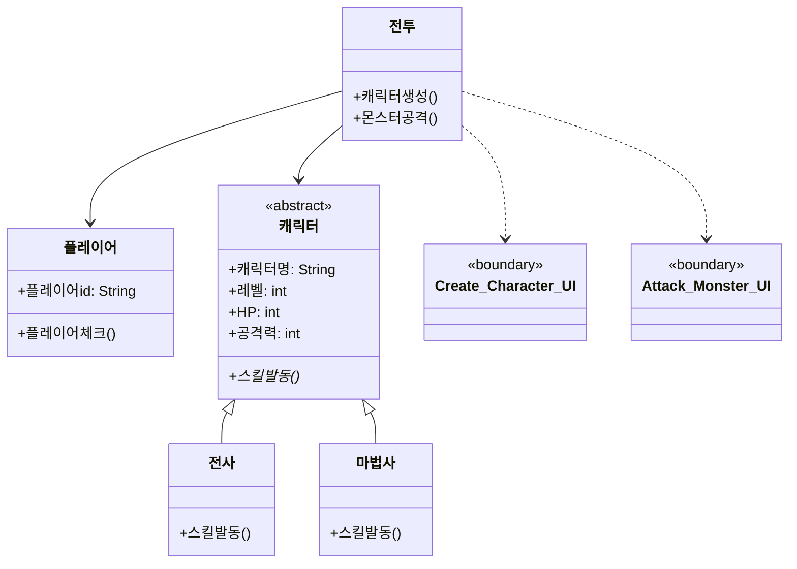

```mermaid
classDiagram
    class 플레이어 {
        +플레이어id: String
        +플레이어체크()
    }
    
    class 캐릭터 {
        <<abstract>>
        +캐릭터명: String
        +레벨: int
        +HP: int
        +공격력: int
        +스킬발동()*
    }
    
    class 전사 {
        +스킬발동()
    }
    
    class 마법사 {
        +스킬발동()
    }
    
    class 전투 {
        +캐릭터생성()
        +몬스터공격()
    }
    
    class Create_Character_UI {
        <<boundary>>
    }
    
    class Attack_Monster_UI {
        <<boundary>>
    }
    
    캐릭터 <|-- 전사
    캐릭터 <|-- 마법사
    
    전투 ..> Create_Character_UI
    전투 ..> Attack_Monster_UI
    전투 --> 플레이어
    전투 --> 캐릭터
```