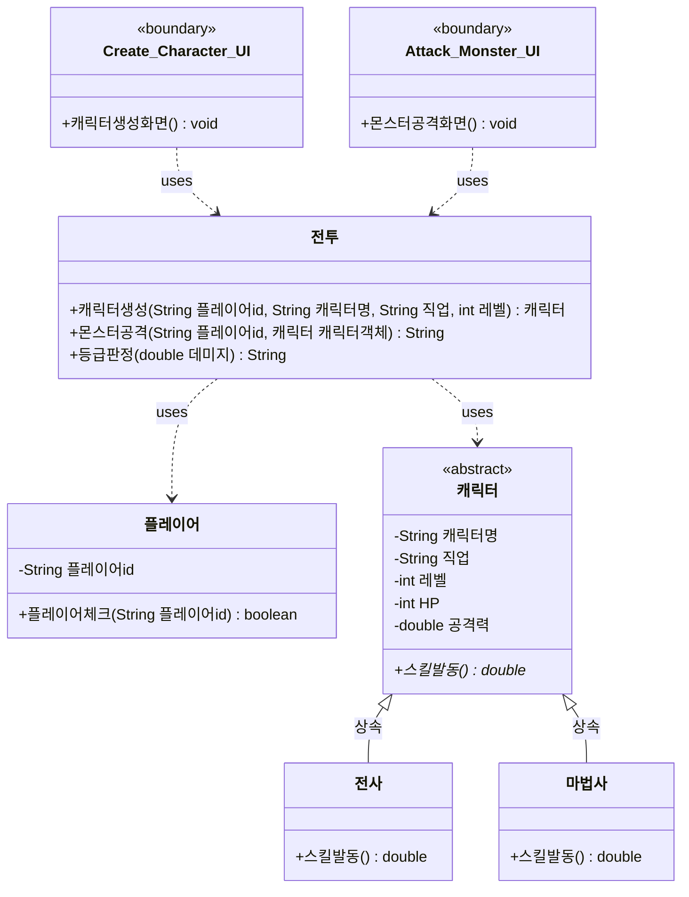

```mermaid
classDiagram
    class 플레이어 {
        -String 플레이어id
        +플레이어체크(String 플레이어id) boolean
    }
    
    class 캐릭터 {
        <<abstract>>
        -String 캐릭터명
        -String 직업
        -int 레벨
        -int HP
        -double 공격력
        +스킬발동() double*
    }
    
    class 전사 {
        +스킬발동() double
    }
    
    class 마법사 {
        +스킬발동() double
    }
    
    class 전투 {
        +캐릭터생성(String 플레이어id, String 캐릭터명, String 직업, int 레벨) 캐릭터
        +몬스터공격(String 플레이어id, 캐릭터 캐릭터객체) String
        +등급판정(double 데미지) String
    }
    
    class Create_Character_UI {
        <<boundary>>
        +캐릭터생성화면() void
    }
    
    class Attack_Monster_UI {
        <<boundary>>
        +몬스터공격화면() void
    }
    
    캐릭터 <|-- 전사 : 상속
    캐릭터 <|-- 마법사 : 상속
    
    전투 ..> 캐릭터 : uses
    전투 ..> 플레이어 : uses
    Create_Character_UI ..> 전투 : uses
    Attack_Monster_UI ..> 전투 : uses
```