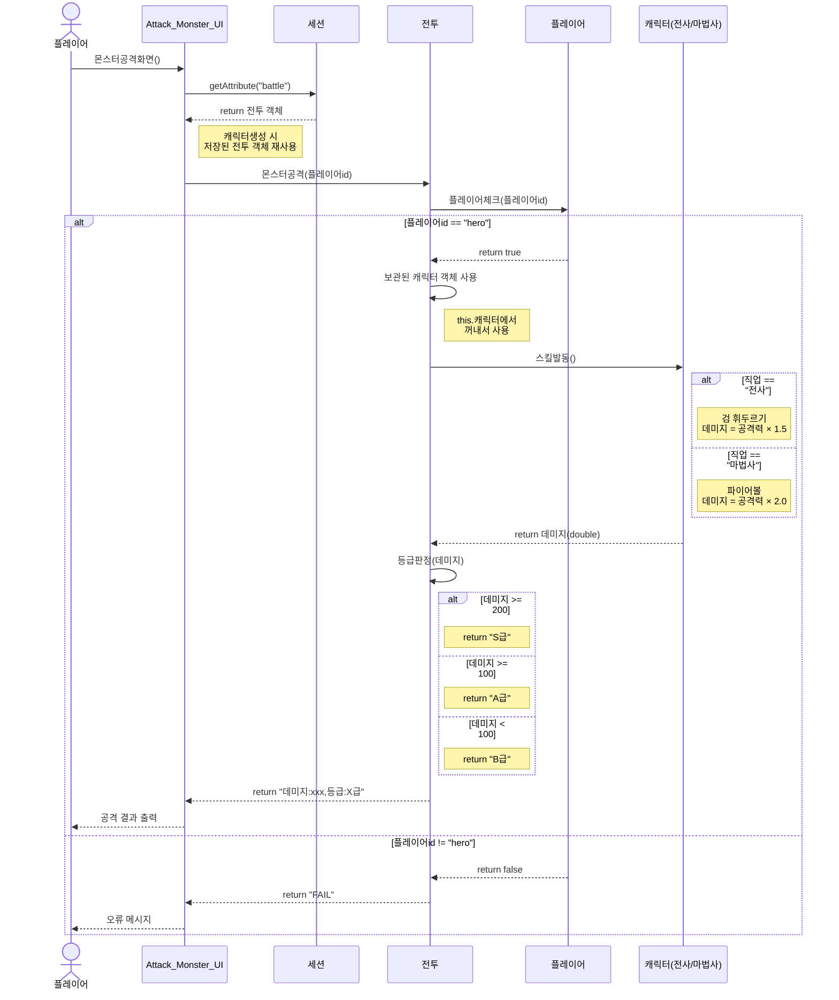

```mermaid
sequenceDiagram
    actor Player as 플레이어
    participant UI as Attack_Monster_UI
    participant Session as 세션
    participant Battle as 전투
    participant PlayerObj as 플레이어
    participant Character as 캐릭터(전사/마법사)
    
    Player->>UI: 몬스터공격화면()
    
    UI->>Session: getAttribute("battle")
    Session-->>UI: return 전투 객체
    Note right of UI: 캐릭터생성 시<br/>저장된 전투 객체 재사용
    
    UI->>Battle: 몬스터공격(플레이어id)
    
    Battle->>PlayerObj: 플레이어체크(플레이어id)
    
    alt 플레이어id == "hero"
        PlayerObj-->>Battle: return true
        
        Battle->>Battle: 보관된 캐릭터 객체 사용
        Note right of Battle: this.캐릭터에서<br/>꺼내서 사용
        
        Battle->>Character: 스킬발동()
        
        alt 직업 == "전사"
            Note right of Character: 검 휘두르기<br/>데미지 = 공격력 × 1.5
        else 직업 == "마법사"
            Note right of Character: 파이어볼<br/>데미지 = 공격력 × 2.0
        end
        
        Character-->>Battle: return 데미지(double)
        
        Battle->>Battle: 등급판정(데미지)
        
        alt 데미지 >= 200
            Note right of Battle: return "S급"
        else 데미지 >= 100
            Note right of Battle: return "A급"
        else 데미지 < 100
            Note right of Battle: return "B급"
        end
        
        Battle-->>UI: return "데미지:xxx,등급:X급"
        UI-->>Player: 공격 결과 출력
    else 플레이어id != "hero"
        PlayerObj-->>Battle: return false
        Battle-->>UI: return "FAIL"
        UI-->>Player: 오류 메시지
    end
```