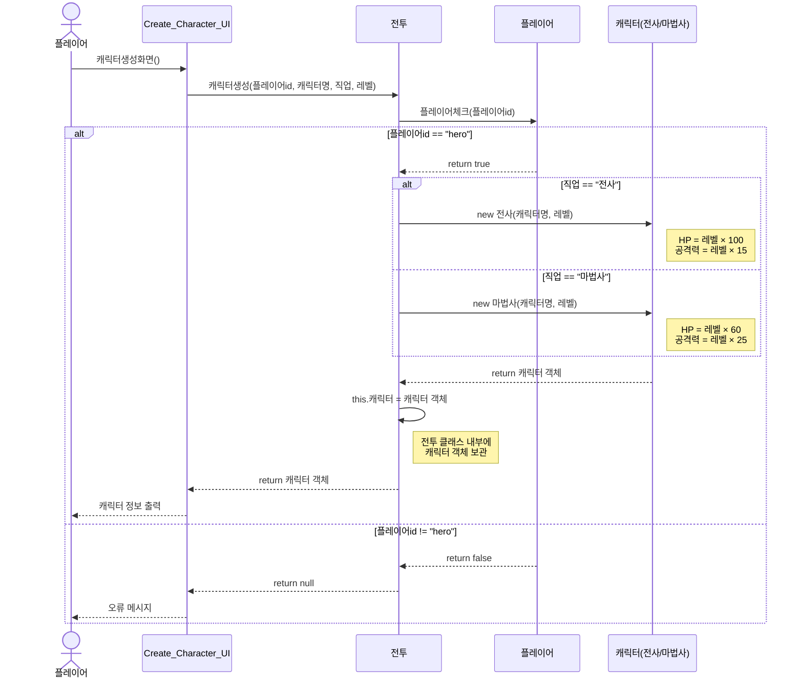

```mermaid
sequenceDiagram
    actor Player as 플레이어
    participant UI as Create_Character_UI
    participant Battle as 전투
    participant PlayerObj as 플레이어
    participant Character as 캐릭터(전사/마법사)
    
    Player->>UI: 캐릭터생성화면()
    UI->>Battle: 캐릭터생성(플레이어id, 캐릭터명, 직업, 레벨)
    
    Battle->>PlayerObj: 플레이어체크(플레이어id)
    
    alt 플레이어id == "hero"
        PlayerObj-->>Battle: return true
        
        alt 직업 == "전사"
            Battle->>Character: new 전사(캐릭터명, 레벨)
            Note right of Character: HP = 레벨 × 100<br/>공격력 = 레벨 × 15
        else 직업 == "마법사"
            Battle->>Character: new 마법사(캐릭터명, 레벨)
            Note right of Character: HP = 레벨 × 60<br/>공격력 = 레벨 × 25
        end
        
        Character-->>Battle: return 캐릭터 객체
        
        Battle->>Battle: this.캐릭터 = 캐릭터 객체
        Note right of Battle: 전투 클래스 내부에<br/>캐릭터 객체 보관
        
        Battle-->>UI: return 캐릭터 객체
        UI-->>Player: 캐릭터 정보 출력
    else 플레이어id != "hero"
        PlayerObj-->>Battle: return false
        Battle-->>UI: return null
        UI-->>Player: 오류 메시지
    end
```